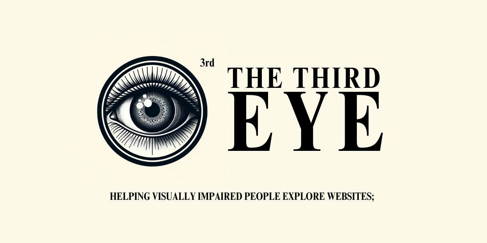

## The Third Eye - the new approach for Visually Impaired People to Navigate Websites

### Introduction

The Third Eye is a science fair project for which I built a [Google Chrome Extension](https://developer.chrome.com/docs/extensions) that helps people with visual problems not only understand the context of pages but also interact with them so they can benefit from the world of information—the Internet.

What makes this project even more shine is its optimization for the diverse types of blindness(available to people with the problems of Colour Blindness, Partial Blindness, and Bluriness) and well incorporation between real problems and AIs. The differentiated features will be provided for each type of blindness. And people who cannot see the details(partial and blurriness) would get help from AIs that are provided by [OpenAI](https://platform.openai.com/).

### Science Fair

As you already read in the introduction section, it is a science fair project. The standard science fair projects are the projects where they set variables, make hypotheses, do experiments, and make a conclusion about the experiment. However, I did it in a slightly different way, which is to do an invention project as a science fair project. So, it was important to let people know that this is not an experiment project but an invention project and explain why I changed it. For more detailed information about how I did all the science fair stuff, you can click [here](./docs/SCIENCEFAIR/README.md).

### WINNING AWARDS

Not yet...

### HOW TO CONTRIBUTE

If you want to contribute to this project, click [here](./docs/CONTRIBUTING.md) and follow the instructions.

### HOW IT WORKS

If you want to know about how things are working together in this project, click [here](./docs/HOW.md) to check everything you need to know about it.
