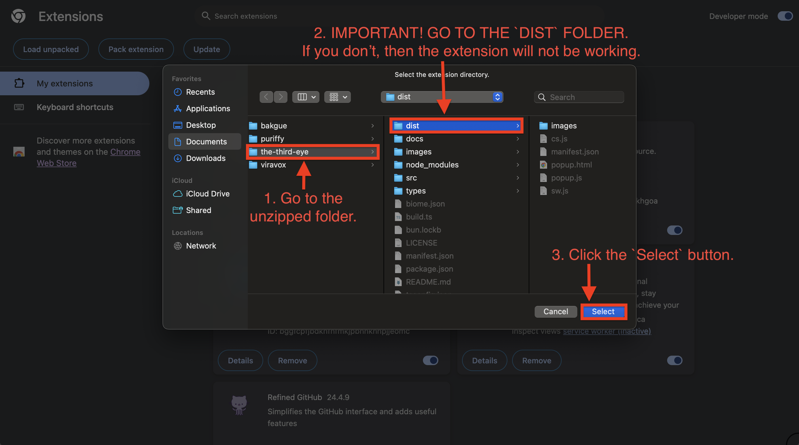

# INSTALLATION

In this document, I will walk you through how to use this extension on your computer locally since this extension could not have been published to the Chrome Web Store, very unfortunately.

## HOW TO INSTALL

#### 1. Clone this project

- If you know how to use `git`, then you can simply clone this project by using `git` and go to the second step.

  ```sh
  git clone https://github.com/fivepixels/the-third-eye
  ```

- If you do not know how to use `git`, then you can download this project by going to the main page and clicking a couple of buttons like the image below.

  1. Cloning
     

  2. Unzipping
     

#### 2. Change to Developer Mode

If you are done following through the first step, what you have to do is to let Google Chrome know that the installed path is the path that Google should reference, making an extension locally.

First, you have to go to [the secure chrome page for extensions](chrome://extension), which is `chrome://extension`, and turn on the developer mode.


#### 3. Select the folder

You can now select the specific folder to finish installing. **_DO NOT FORGET TO SELECT THE `DIST` FOLDER INSIDE OF THE ROOT DIRECTORY_**





## HOW TO REMOVE

How to remove this extension is pretty easy compared to how to install it. You can just click two buttons.


