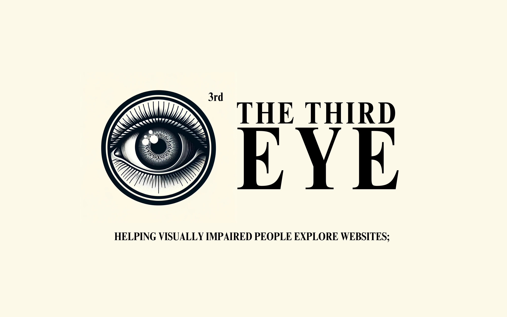

# THE THIRD EYE

## Project Board - virtual

VIDEO

<!-- Video Link -->

YOu can find the original video on YouTube here.

WHY?

#### The Inspiration:

I read [this blog post](https://blog.hubspot.com/website/website-accessibility-for-blind) from HubSpot explaining how to make websites accessible to everyone, including visually impaired people. After realizing many people do not know how to make their websites accessible, I thought it would be a good idea to invent something that makes the websites accessible, providing a high level of user experience for visually impaired people.

#### Background Research

- According to [the World Health Organization(WHO)](https://www.who.int/), it is estimated that there are [at least 2.2 Bilion of the global population have problems with their visions](https://www.who.int/news-room/fact-sheets/detail/blindness-and-visual-impairment).
- According to [Statista](https://www.statista.com/), the number of internet and social media users is estimated to be [5.35 Billion people](https://www.statista.com/statistics/617136/digital-population-worldwide/).
- According to [WebAIM](https://webaim.org/), [the top 95.9% of the websites are not accessible and detected WCAG2 failures](https://webaim.org/projects/million/), which is the Web Content Accessibility Guidelines.

#### The Question

What is the most effective way to increase the accessibility of all websites generally for visually impaired people without having to implement all necessary accessibility functions on their own?

#### The Solution

The solution to this was to build something that has high access to all websites users visit so that the websites can have high accessibility functions without having to build them manually. For that specific situation, [the Google Chrome Extension](https://developer.chrome.com/docs/extensions) was the best choice since it has the ability to

- Every single website that users visit
- Grab the information from the websites
- Analyze received information
- Interact with third-party services
- Edit the page
- Use incredible features provided by Google Chrome API, such as TTS

HOW?

#### Design Processes

- Identified the problem that many websites are not accessible to visually impaired people.
- Specified three types of blindness that this extension should be responsible for: Partial Blindness, Blurriness, and Colour blindness.
- Planned the approach of developing a Google Chrome Extension to achieve the goal.
- Designed what is called Helpers. There are the Mover for Partial Blindness, the Colour Adjuster for Colour Blindness, and the AI Helpers for blurriness.
- Developed the extension with the documentation by the Google Chrome Extension team and the planner.
- Got feedback from a Google Employee for code review.

#### Architecture

- The content scripts are the actual codes that are running on the websites, communicating and passing data with the service workers.
- The service workers are running in a separate world doing stuff like saving data and using an API from the OpenAI.
- The content scripts modify the web client by using Helpers, while the service workers communicate with external services to get advanced data.
- If you want to go and dive deeply, you can check all source code on GitHub.

#### Implemented Features

Instead of listing all features, I will introduce you to the main ideas of all features.

- Keyboards - when it comes to accessibility, it is a wise choice to allow the users to use many shortcuts to modify, for example options, preferences and actions.
- Colours - for the users with blurriness problems, I tried my best to make indicators appearing on the screen colourful with very strong colours; a similar idea to make something highly contrasted.
- TTS - since this extension is for visually impaired people, it was important to let the users know what is happening anyway. One of the best ways to do so is to use TTS to speak it out. I used this approach for the AI Helpers.

WHAT?

#### Languages

I used HTML and CSS to build the UI/UX on the option configuring popup window. I used TypeScript instead of JavaScript to deal with everything in this extension. I was required to use JavaScript, a scripting language used to make websites interactable and do logical processes. However, I decided to move on to TypeScript, which is an extended version of JavaScript to get type safety. There was no trouble because I could simply compile all TypeScript files into a small number of JavaScript files, even with features for optimizing only for browsers.

#### Packages

When it comes to the JavaScript/TypeScript ecosystem, it is pretty common to use packages, but in this project, I did not use any packages to

- Reduce the potential of any errors occurring while users use this product. Errors happening would be a big issue because, without that extension, sometimes, the users can not navigate through the websites.
- Make the final compiled product as light as possible. Once I install a single package and try to compile it, the final JavaScript file will be huge, having over ten thousand lines. Due to computers' performances being so good, it might not be a good reason for not using any packages, but I want to keep everything as fast as possible in a predictable way.
- Avoid making things complex. If I have too many features to use and shortcuts to go, it would be very easy to get complex, obviously causing the final product itself to be complex and harder for visually impaired people to use. To keep everything simple, I did not use any packages and implemented all features on my own.

#### Extra Tools

This project is based on Bun, compiling all TypeScript files into JavaScript files and building the final product that is ready to be shipped out to your Google Chrome Extension list. This also used BiomeJS, which is for formatting and linting codes.

#### Google Chrome APIS

This extension requires two permissions from the users: the Storage permission and the TTS permission. The Storage Permission is for storing data in the Google Chrome database. The reason why I did not use any external databases, such as MongoDB or PostgreSQL, was because the data shape is pretty simple, and Google Chrome's storage API already provided enough functionalities that this extension requires. And, the TTS permission is required to speak the scripts from the AI out and read the notifications.

#### External APIs

Some features in this extension rely on the OpenAI's ChatGPT APIs to make a descriptive script about a page, a group of texts, and an image. As you can see in the flowchart, the service workers are in charge of this. I used it because there were no possible ways that I could think of, and I could analyze pages and images dynamically and make a descriptive script for them. However, it leads to the main issue where I cannot publish it because of the private policy.

SO WHAT?

WHAT'S NEXT?

#### Future Considerations:

- Build up an AI that works on users' devices locally without using the Internet so that the sensitive information this extension grabs can not be shared with external services.
- Publish it, which could not have happened due to its security regarding the AI.
- Make a trend that developers can easily follow so that the trend of helping visually impaired people can be spread out.
- Allow other developers to write their helper, like any other built-in helpers, based on this extension so that the users can choose any provided helpers to enhance their experience on the specific websites.

THANKS

Thank you to Mrs. Guse and Ms. S at Albert College for helping me prepare for many science fairs: The Albert College Science Fair, [The QRSTF](http://www.qrstf.ca/), and finally, The Canada-Wide Science Fair, and supporting me through my science fair journey by sometimes crafting the boards together, giving me so much advice for example how to do the presentations well, and providing me with the information and research.

Thank you to Mr. Woogie, a Google Employee, for doing amazing code reviews(which was the first ever code review for me) in terms of technological problems and serious issues, like licensing and private policies.

This project, The Third Eye, could have gone to the Canada-Wide Science Fair, not because I did this project, but because Mrs. Guse, Ms. S, Mr. Woogie and a lot of people in the QRSTF team helped me literally a lot.

Thank you so much to everyone.

REEFERENCES

## Project Sheets - physical

...in progress
