# THE THIRD EYE

## Board and Materials Images

|                                   Whole Board                                    |
| :------------------------------------------------------------------------------: |
| 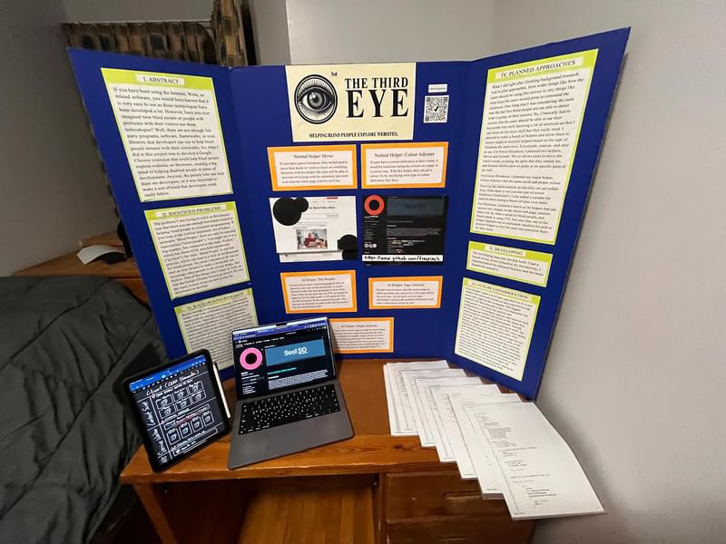 |

|                                            LEFT SIDE                                            |                                               MIDDLE                                                |                                            RIGHT SIDE                                             |
| :---------------------------------------------------------------------------------------------: | :-------------------------------------------------------------------------------------------------: | :-----------------------------------------------------------------------------------------------: |
| 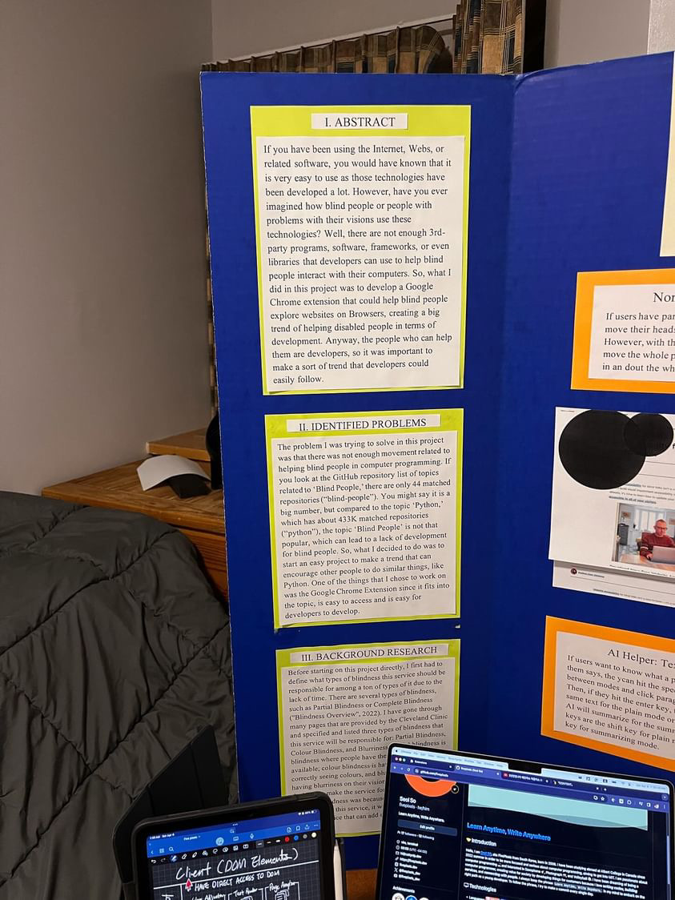 | 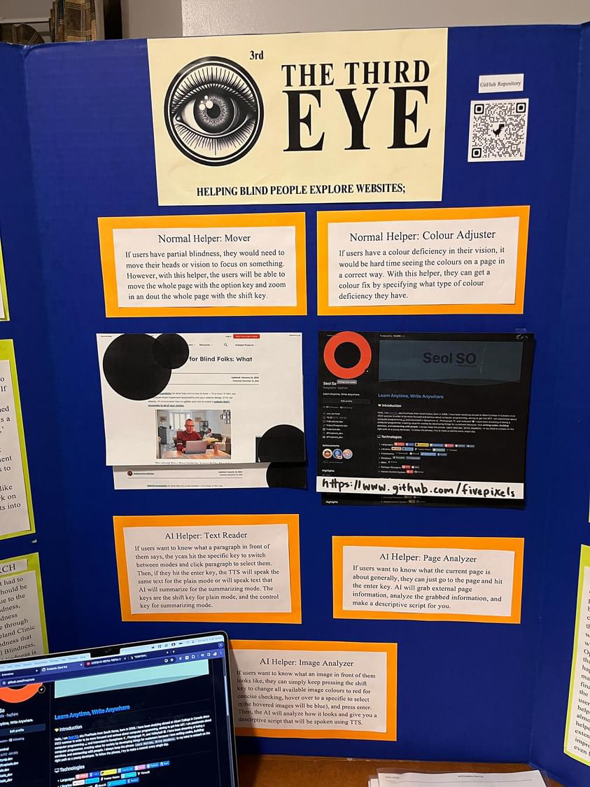 | 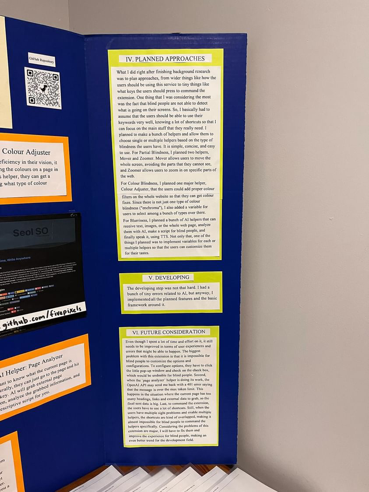 |

|                                       Computer                                       |                                     iPad                                     |                                      Diagram                                       |                                        Printed Codes                                         |
| :----------------------------------------------------------------------------------: | :--------------------------------------------------------------------------: | :--------------------------------------------------------------------------------: | :------------------------------------------------------------------------------------------: |
| 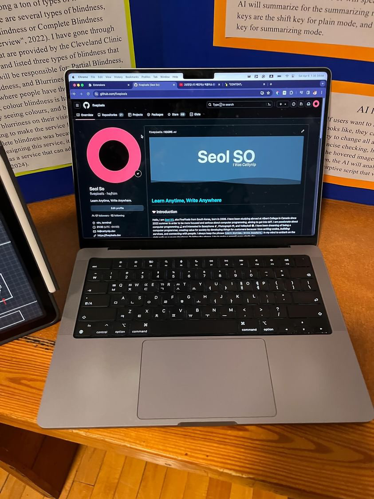 | 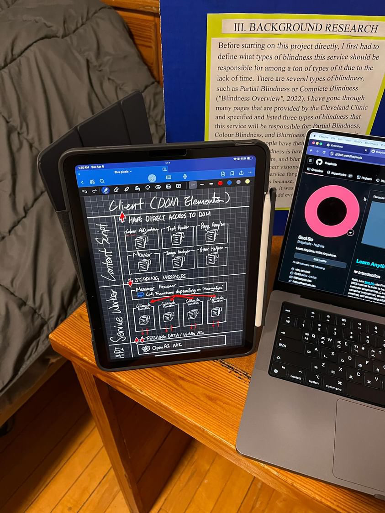 | 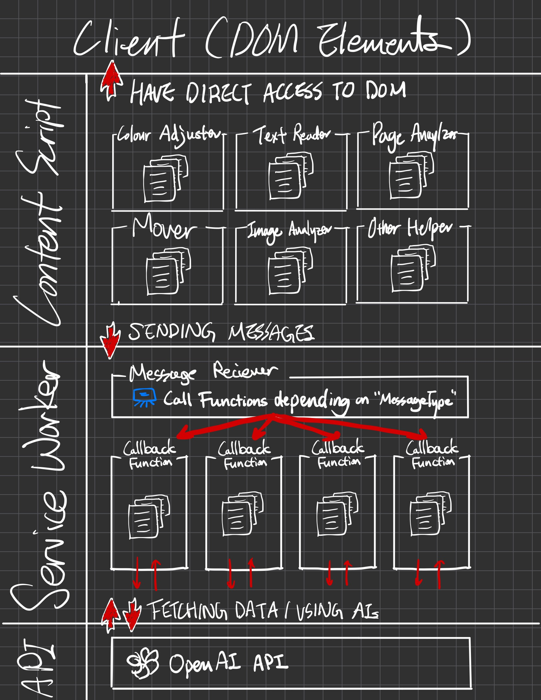 | 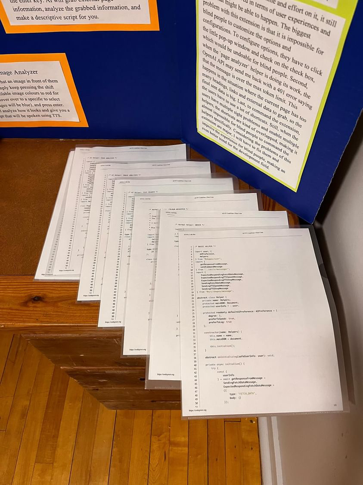 |

## LEFT SIDE

### I. ABSTRACT

If you have been using the Internet, Webs, or related software, you would have known that it is very easy to use as those technologies have been developed a lot. However, have you ever imagined how blind people or people with problems with their visions use these technologies? Well, there are not enough 3rd-party programs, software, frameworks, or even libraries that developers can use to help blind people interact with their computers. So, what I did in this project was to develop a Google Chrome extension that could help blind people explore websites on Browsers, creating a big trend of helping disabled people in terms of development. Anyway, the people who can help them are developers, so it was important to make a sort of trend that developers could easily follow.

### II. IDENTIFIED PROBLEMS

The problem I was trying to solve in this project was that there was not enough movement related to helping blind people in computer programming. If you look at the GitHub repository list of topics related to ‘Blind People,’ there are only 44 matched repositories (“blind-people”). You might say it is a big number, but compared to the topic ‘Python,’ which has about 433K matched repositories (“python”), the topic ‘Blind People’ is not that popular, which can lead to a lack of development for blind people. So, what I decided to do was to start an easy project to make a trend that can encourage other people to do similar things, like Python. One of the things that I chose to work on was the Google Chrome Extension since it fits into the topic, is easy to access and is easy for developers to develop.

### III. BACKGROUND RESEARCH

Before starting on this project directly, I first had to define what types of blindness this service should be responsible for among a ton of types of it due to the lack of time. There are several types of blindness, such as Partial Blindness or Complete Blindness ("Blindness Overview", 2022). I have gone through many pages that are provided by the Cleveland Clinic and specified and listed three types of blindness that this service will be responsible for: Partial Blindness, Colour Blindness, and Blurriness. Partial blindness is blindness where people have their vision partially available; colour blindness is having a problem with correctly seeing colours, and blurriness is literally having blurriness on their visions. The reason for not deciding to make the service for people who have complete blindness was because, at the time when I was designing this service, it was not possible to help them as a service that can add every change visually (SO, 2024).

## MIDDLE SIDE

### Normal Helper: Mover

If users have partial blindness, they would need to move their heads or vision to focus on something. However, with this helper, the users will be able to move the whole page with the option key and zoom in an dout the whole page with the shift key.

|                                         Before                                         |                                        After                                         |
| :------------------------------------------------------------------------------------: | :----------------------------------------------------------------------------------: |
| 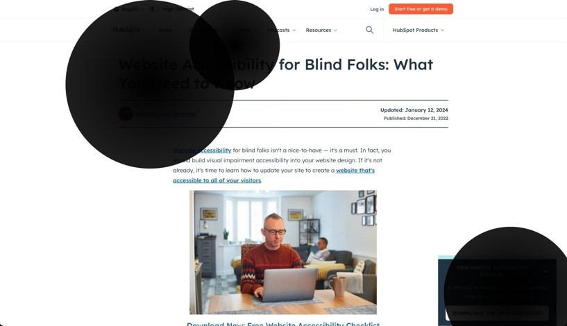 | 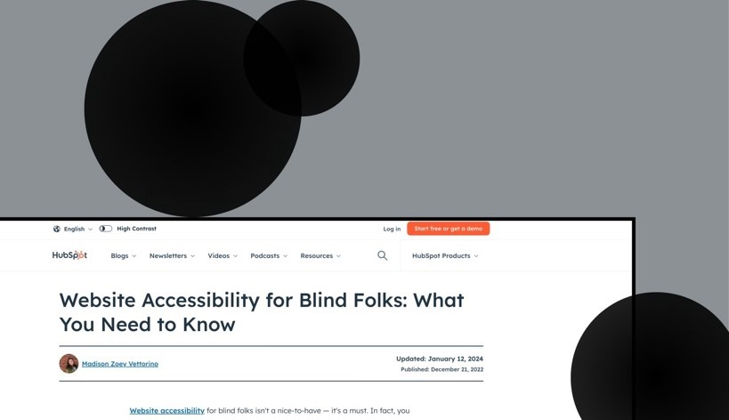 |

### Normal Helper: Colour Adjuster

If users have a colour deficiency in their vision, it would be hard time seeing the colours on a page in a correct way. With this helper, they can get a colour fix by specifying what type of colour deficiency they have.

|                                                   Before                                                   |                                                  After                                                   |
| :--------------------------------------------------------------------------------------------------------: | :------------------------------------------------------------------------------------------------------: |
| 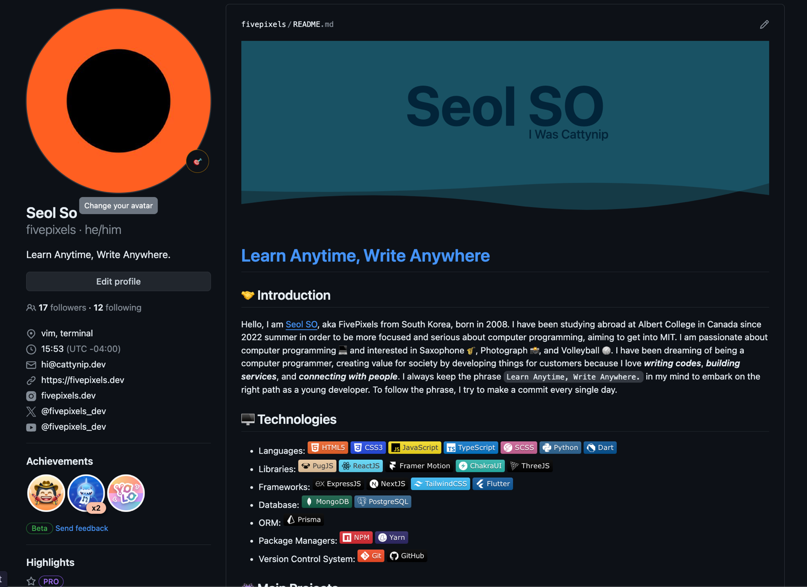 | 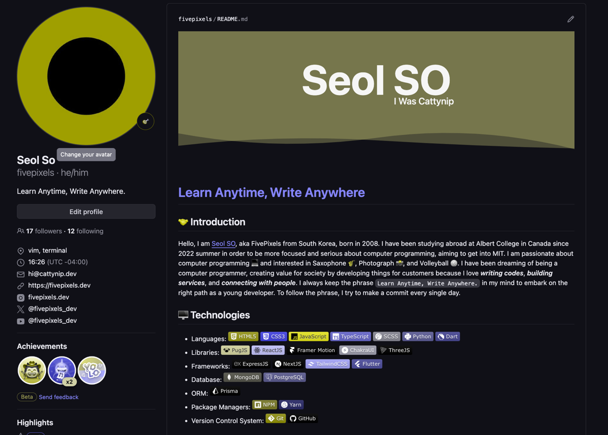 |

### AI Helper: Text Reader

If users want to know what a paragraph in front of them says, the ycan hit the specific key to switch between modes and click paragraph to select them. Then, if they hit the enter key, the TTS will speak the same text for the plain mode or will speak text that AI will summarize for the summarizing mode. The keys are the shift key for plain mode, and the control key for summarizing mode.

### AI Helper: Image Analyzer

If users want to know what an image in front of them looks like, they can simply keep pressing the shift key to change all available image colours to red for concise checking, hover over to a specific to select it(the hovered images will be blue), and press enter. Then, the AI will analyze how it looks and give you a descirptive script that will be spoken using TTS.

### AI Helper: Page Analyzer

If users want to know what the current page is about generally, they can just go to the page and hit the enter key. AI will grab external page information, analyze the grabbed information, and make a descriptive script for you.

## RIGHT SIDE

### IV. PLANNED APPROACHES

What I did right after finishing background research was to plan approaches, from wider things like how the users should be using this service to tiny things like what keys the users should press to command the extension. One thing that I was considering the most was the fact that blind people are not able to detect what is going on their screens. So, I basically had to assume that the users should be able to use their keywords very well, knowing a lot of shortcuts so that I can focus on the main stuff that they really need. I planned to make a bunch of helpers and allow them to choose single or multiple helpers based on the type of blindness the users have. It is simple, concise, and easy to use. For Partial Blindness, I planned two helpers, Mover and Zoomer. Mover allows users to move the whole screen, avoiding the parts that they cannot see, and Zoomer allows users to zoom in on specific parts of the web.

For Colour Blindness, I planned one major helper, Colour Adjuster, that the users could add proper colour filters on the whole website so that they can get colour fixes. Since there is not just one type of colour blindness ("enchroma"), I also added a variable for users to select among a bunch of types over there.

For Blurriness, I planned a bunch of AI helpers that can receive text, images, or the whole web page, analyze them with AI, make a script for blind people, and finally speak it, using TTS. Not only that, one of the things I planned was to implement variables for each or multiple helpers so that the users can customize them for their tastes.

### V. DEVELOPING

The developing step was not that hard. I had a bunch of tiny errors related to AI, but anyway, I implemented all the planned features and the basic framework around it.

### VI. FUTURE CONSIDERATION

Even though I spent a lot of time and effort on it, it still needs to be improved in terms of user experiences and errors that might be able to happen. The biggest problem with this extension is that it is impossible for blind people to customize the options and configurations. To configure options, they have to click the little pop-up window and check on the check box, which would be undoable for blind people. Second, when the `page analyzer` helper is doing its work, the OpenAI API may send me back with a 401 error saying that the message is over the max token limit. This happens in the situation where the current page has too many headings, links and external data to grab, so the final sent data is big. Last, to command the extension, the users have to use a lot of shortcuts. Still, when the users have multiple sight problems and enable multiple helpers, the shortcuts are kind of overlapped, making it almost impossible for blind people to command the helpers specifically. Considering the problems of this extension are major, I will have to fix them and improve the experience for blind people, making an even better trend for the development field.
